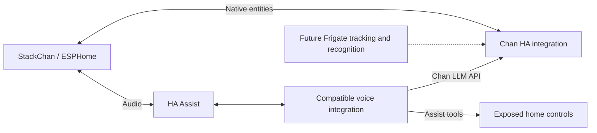

# Chan for Home Assistant

ESPHome firmware and a Home Assistant integration for the official stock M5Stack
StackChan with a CoreS3-based controller. Chan stays quiet until activated, then
shows a face and starts an Assist conversation in Ukrainian.

**v0.1.1 is the first audio/display test.** Head movement, camera/Frigate tracking,
per-person memory, and full-duplex voice interruption are later milestones.

## Installation: ESPHome Device Builder + HACS

You do not need to clone this repository, install Python, or copy integration,
firmware, header, or artwork files. ESPHome downloads the firmware package;
HACS installs the Chan integration.

Requirements:

- The official stock StackChan; verify its hardware revision before flashing.
- Home Assistant **2026.10.0** as the tested integration baseline.
- ESPHome Device Builder **2026.9.1** as the tested build baseline.
- [HACS](https://www.hacs.dev/docs/use/), already installed in Home Assistant.
- A working Assist pipeline for the first voice test.

### 1. Add the firmware package in ESPHome

1. Open **ESPHome Device Builder** in HA and create a device named `chan`.
   Keep the API encryption key generated in its initial configuration. The wizard
   configuration will be replaced by the node configuration below.
2. Open ESPHome's **Secrets** editor. Keep your `wifi_ssid` and `wifi_password`
   entries and add `chan_api_key` containing that generated key. Use a unique key
   for your robot; do not use the public development example key.
3. Open the device's **Edit** action and replace its YAML with:

```yaml
substitutions:
  name: chan
  friendly_name: Chan

packages:
  chan: github://alexeyzel/chan-home-assistant/firmware/chan.yaml@v0.1.1

wifi:
  ssid: !secret wifi_ssid
  password: !secret wifi_password

api:
  encryption:
    key: !secret chan_api_key
```

4. Select **Save**, then **Validate**. ESPHome fetches the package, its included
   YAML files, and the pinned M5Stack drivers automatically. The face renderer
   is embedded in YAML and requires no local C++ header or image files.
5. Connect the robot with a USB data cable and select **Install**. If it is
   connected to the HA/ESPHome host, choose the host's USB/serial installation
   option. If connected to your computer, choose the browser USB installation
   option when available. Browser flashing requires supported Web Serial access;
   ESPHome's download-and-flash option is the fallback, not a Python/CLI install.
6. After flashing, the robot should connect to Wi-Fi with its screen dark and
   conversation off. Subsequent firmware updates can be installed wirelessly
   through ESPHome using the configured encryption key.

Before replacing factory firmware, identify the official recovery procedure for
[your StackChan](https://docs.m5stack.com/en/StackChan) and retain access to
[M5Burner](https://docs.m5stack.com/en/uiflow/m5burner/intro). Do not change GPIOs,
power rails or wiring assumptions to troubleshoot flashing.

The package is pinned to `v0.1.1` for reproducibility. To update firmware, change
that version in your node YAML to a tested release and use **Install** again.
HACS updates the HA integration separately; it does not flash the robot.

### 2. Install Chan through HACS

1. Open **HACS** → top-right **⋮** → **Custom repositories**.
2. Enter `https://github.com/alexeyzel/chan-home-assistant`.
3. Select type **Integration**, then **Add**.
4. Find **Chan** in HACS and select **Download** for the published release.
5. Restart Home Assistant when prompted.

This repository contains exactly one HA integration, with HACS metadata. No
manual transfer into `custom_components` is required. If upgrading an earlier
manual installation, HACS downloads the same `chan` integration directory; keep
its existing configuration entry unless the underlying ESPHome device was recreated.

See [HACS custom repository instructions](https://www.hacs.dev/docs/faq/custom_repositories/).

### 3. Connect the robot and configure Chan

1. In **Settings → Devices & services**, add the discovered robot through
   **ESPHome**. If discovery is unavailable, enter its IP address and your API key.
2. Assign a working Assist pipeline through the ESPHome device's voice
   assistant/pipeline selector. Use Ukrainian where the selected providers support it.
3. Select **Add integration → Chan**.
4. Choose the native ESPHome entities **Chan Active**, **Chan Expression**, and
   **Chan Phase**, all belonging to the same robot. Actual entity IDs may vary.

Chan creates a Conversation switch, Expression select, and Voice state sensor.
Entity labels have Ukrainian translations. Bindings use registry IDs and survive
entity renames. Recreating the ESPHome device/entities requires re-adding Chan.

## First device test

1. Confirm a dark screen, Conversation off, and no head movement after boot.
2. Turn Conversation on. A face should appear and the robot should listen.
3. Ask a short Ukrainian question and verify capture, a spoken answer, state
   feedback, and the next listening turn. Measure the response delay.
4. During an active interaction, select `happy` or `warm`. Expressions return to
   neutral after eight seconds or a subsequent listening/playback event.
5. Turn Conversation off during a reply. Verify playback stops and the screen
   remains dark even if late pipeline events arrive.
6. Disconnect HA and Wi-Fi separately. Verify safe inactivity and no automatic
   reactivation after reconnection. Activate again explicitly.
7. Optionally enable native **Chan Touch Activation**, then tap the screen to
   toggle Conversation. Touch activation defaults off again after a reboot.

There is no inactivity timeout in this test; end the interaction explicitly.
There is no wake word, camera, servo driver, or motion command. The Assist loop
listens again **after** playback; it is not full duplex. Stopping an interaction
requests audio stop and resets the ESPHome conversation ID. Provider errors end
an interaction and require explicit reactivation.

## Architecture and current capabilities



Chan runs inside HA; no separate server, add-on, or web interface is introduced.
Audio uses ESPHome/Assist. Chan coordinates activation and expression tools.

| Feature | Status |
| --- | --- |
| ESPHome audio/display/optional screen touch | Implemented from M5Stack definitions; physical device test required |
| Six original geometric expressions and voice-state feedback | Implemented |
| HA configuration flow, Conversation switch, Expression select, Voice state sensor | Implemented |
| Device-scoped `chan_set_expression` LLM tool | Implemented with stale-request guards |
| Gemini Live via a community integration | Experimental; compatibility limitation described below |
| Voice interruption, motion, camera/Frigate tracking, personal memory, Guard | Not implemented/verified |

The Chan API exposes expressions only for its configured robot during an active
listening/thinking/speaking state. Browser calls without the matching device ID
receive no expression tool. Requests expire after 15 seconds and are invalidated
on a new listening turn, sleep, observed disconnection, or integration unload.
Expressions are not synchronized to individual words. Keep robot activation and
raw firmware controls unexposed to generic Assist tools.

No transcripts or personal memory are stored by Chan v0.1. The chosen cloud
voice provider still handles audio according to its own configuration.

## Gemini Live: optional, not the standard installation path yet

The independent [matt123p/ha-gemini-live](https://github.com/matt123p/ha-gemini-live)
integration can be installed separately through HACS. However, its inspected
v1.0.9 revision has a reproduced HA 2026.10 ToolResult serialization issue. Do not
expect working home/expression tools on that combination simply by installing it.

The [compatibility document](docs/GEMINI_LIVE.md) records the exact limitation and
a developer patch. Manual patching is not required or recommended for the normal
Chan installation above. Use a working Assist pipeline for the initial test;
a compatible HACS-delivered live backend remains a separate milestone.

When the backend supports the required HA API, configure matching live STT,
conversation and TTS entities in one dedicated Assist pipeline, enable both
**Assist** and **Chan expressions** in its LLM APIs, and select it for the robot.
A live provider does not establish barge-in support on the robot.

## Development and validation

[VALIDATION.md](docs/VALIDATION.md) records software checks and physical tests
still needed. Installation through ESPHome/HACS has no developer CLI requirement.
Developers can use the pinned tools in `requirements-dev.txt` and a separate
Python 3.14.2+ HA environment with `requirements-test.txt`.

CI prepares a clean node from `firmware/chan.example.yaml`, fetches the firmware
through a Git commit, and compiles it without local headers or copied packages.
It also tests real HA registries/services and the optional provider serializer
without a robot or cloud credentials.

## Credits and license

Original Chan code is under [MIT](LICENSE). Hardware definitions are adapted
from M5Stack's official ESPHome example, with its [MIT notice preserved](LICENSES/m5stack-esphome-yaml-MIT.txt).
[THIRD_PARTY.md](THIRD_PARTY.md) lists sources, revisions, licenses, and reused
code versus independently installed dependencies. No artwork, fonts, sounds,
complete robot platform, or voice engine is bundled.
