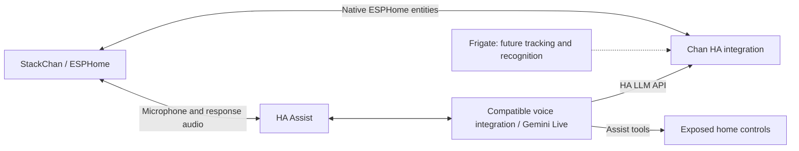

# Chan for Home Assistant

An experimental ESPHome firmware and Home Assistant integration for the official
M5Stack StackChan with a CoreS3-based controller. Chan stays quiet until activated,
then shows a face and starts an Assist conversation in Ukrainian.

**v0.1.0 is the first audio/display test, not the complete robot experience.**
It establishes the firmware → Chan integration → Assist path before adding
camera streaming, head motion, Frigate tracking, and personal memory.

## Architecture



The custom integration runs inside Home Assistant. There is no separate Chan
server, add-on, or web application. Audio uses the existing ESPHome/Assist path;
Chan coordinates device controls and contributes its own expression tool.

## What this version provides

| Feature | v0.1 status |
| --- | --- |
| ESPHome audio, display and touchscreen configuration | Implemented from M5Stack definitions; device test required |
| Explicit activation and stop from HA | Implemented |
| Optional screen-touch activation | Implemented; disabled at every boot until enabled in HA |
| Sleep screen and no active microphone conversation | Implemented; no wake word configured |
| Six original geometric facial expressions | Implemented; no downloaded artwork or fonts |
| Listening/thinking/playback state feedback | Implemented using firmware events |
| Chan HA configuration flow, switch, select and sensor | Implemented |
| Device-scoped `chan_set_expression` LLM tool | Implemented with stale-request guards |
| Assist conversation loop | Configured; listens again after playback |
| Gemini Live via an existing Assist integration | Documented test path; end-to-end robot compatibility unverified |
| Voice interruption while speaking | Not implemented/verified by this firmware |
| Camera transport, Frigate coordinates and head tracking | Next hardware milestone |
| Per-speaker profiles and persistent memory | Planned; no personal data stored by Chan v0.1 |
| Gestures and Guard mode | Not implemented |

The conversation loop is **not full duplex**. A live provider alone does not
make this firmware support barge-in. Switching Conversation off stops listening,
requests playback stop, and resets the ESPHome conversation ID. The next
activation starts a new conversation context.

There is no automatic inactivity timeout in this test. End the interaction
explicitly. Wake-word activation and final inactive behavior remain to be agreed.
No servo drivers or motion commands are configured, and no camera is enabled.

## Requirements and pinned references

- Official stock M5Stack StackChan; verify the SKU and hardware revision before
  flashing. This configuration is not for arbitrary DIY Stack-chan assemblies.
- Home Assistant **2026.10.0** is the integration API/test baseline. Earlier
  releases have not been validated. Product entity translations include Ukrainian.
- ESPHome **2026.9.1**, ESP-IDF **5.5.5** selected by that ESPHome release.
- M5Stack external drivers at commit
  `cc708ddcc9dea7cfc746b408d2495ce281bbf2d2`.
- A working Assist pipeline. First test ordinary Assist; then try a dedicated
  Gemini Live pipeline if desired.

These are software baselines, not a record of a successful physical device test.
See [validation](docs/VALIDATION.md) and [third-party attribution](THIRD_PARTY.md).

## 1. Prepare and flash ESPHome

1. Clone this repository and retain the entire `firmware/` directory, including
   `packages/` and `face.h`.
2. Copy `firmware/secrets.example.yaml` to `firmware/secrets.yaml`.
3. Set the Wi-Fi credentials and generate a **new** API encryption key. The
   example key is public test data and must be replaced:

   ```sh
   python -c "import base64,secrets; print(base64.b64encode(secrets.token_bytes(32)).decode())"
   ```

4. Install the pinned ESPHome version in an isolated Python environment:

   ```sh
   python -m venv .venv
   # Linux/macOS:
   . .venv/bin/activate
   # Windows PowerShell instead:
   # .venv\Scripts\Activate.ps1
   python -m pip install -r requirements-dev.txt
   python -m esphome config firmware/chan.yaml
   python -m esphome compile firmware/chan.yaml
   ```

5. Connect the robot by a USB data cable. Identify its serial port and upload
   using that port, for example:

   ```sh
   python -m esphome upload firmware/chan.yaml --device /dev/ttyACM0
   # Windows example: --device COM5
   python -m esphome logs firmware/chan.yaml --device /dev/ttyACM0
   ```

You can also use ESPHome Device Builder in HA with the same directory structure
and pinned ESPHome version. OTA updates require the configured encryption key.

**Windows paths with spaces:** ESP-IDF linker generation failed in our original
workspace path. Use a checkout/build directory without spaces, or override the
build directory with
`python -m esphome -s build_path C:/chan-build compile firmware/chan.yaml`.

Before flashing, identify a recovery route with
[M5Stack's StackChan documentation](https://docs.m5stack.com/en/StackChan) and
[M5Burner](https://docs.m5stack.com/en/uiflow/m5burner/intro).
Keep the official firmware available. If serial connection fails, use the
documented boot/download procedure for your actual controller revision and
retry over USB. Do not alter GPIOs or power rails to fix a connection problem.

## 2. Add the robot and Chan to Home Assistant

1. Add the robot through HA's **ESPHome** integration, accepting discovery or
   entering its address and the encryption key from your private secrets file.
2. Assign a working Assist pipeline to the ESPHome device using its voice
   assistant/pipeline selector. Use Ukrainian where the selected providers support it.
3. Copy `custom_components/chan` into `<HA config>/custom_components/chan`.
   Restart Home Assistant.
4. Open **Settings → Devices & services → Add integration → Chan**.
5. Select the native ESPHome entities named **Chan Active**, **Chan Expression**,
   and **Chan Phase**, all from the same robot. Entity IDs may vary.
6. Chan creates a Conversation switch, Expression select, and Voice state sensor.

The configuration stores registry IDs, so renaming those firmware entities does
not change the binding. Recreating the ESPHome device/entities requires removing
and re-adding the Chan entry.

## 3. First device test

1. Confirm the robot boots with a dark screen and Conversation off.
2. Turn Conversation on. A face should appear and the robot should listen.
3. Ask a short Ukrainian question. Check microphone capture, a spoken reply,
   the state dot, and the next listening turn.
4. While active, choose `happy` or `warm` using the Expression select. Expressions
   return to neutral after eight seconds or a subsequent listening/playback event.
5. Stop Conversation during a response. Verify that playback actually stops and
   the screen goes dark; record any residual buffering delay.
6. Optionally enable the native **Chan Touch Activation** switch, then tap the
   screen to toggle the conversation. It defaults off again after a reboot.
7. Disconnect HA/network and verify the robot ends the active interaction. It
   must remain inactive after reconnection until explicitly activated.

Read [the hardware checklist](docs/VALIDATION.md) before treating a test as passed.
Provider errors currently end the interaction; reactivate explicitly after fixing
the error. Transcripts are not exposed as Chan entities or saved by this integration.
The selected cloud voice provider still processes audio under its own configuration.

## 4. Try Gemini Live and contextual expressions

[matt123p/ha-gemini-live](https://github.com/matt123p/ha-gemini-live) is an optional,
independent community integration. It is not the official HA Google Gemini
integration and is not bundled here. We inspected v1.0.9 at commit
`d4ad0e523eca92f1c395e82da14d6da0fafd71be`; device interoperability remains unverified.

1. Install and configure that integration according to its own instructions.
   **For the inspected v1.0.9 revision on HA 2026.10.0, apply the included
   [ToolResult compatibility patch](docs/GEMINI_LIVE.md) first.** We reproduced
   an SDK validation failure without this fix. Keep the provider key in HA,
   never in robot firmware.
2. Build a dedicated Assist pipeline using the matching live **STT, conversation,
   and TTS** entities from the same entry. Assign it to the robot.
3. In its **LLM APIs** options, keep **Assist** for permitted home actions and
   also enable **Chan expressions**. Keep home entity exposure minimal and leave
   the robot's activation and raw firmware controls unexposed to Assist.
4. Set the voice agent's system instruction to Ukrainian conversation, for example:

   ```text
   You are Chan, a calm, friendly home robot. Speak Ukrainian naturally and briefly.
   Use the provided Chan expression tool sparingly when appropriate to your response.
   Keep routine home-control confirmations neutral. Do not announce tool calls.
   ```

5. Activate Chan from HA and try a celebratory statement or a request for support.
   Inspect the Assist trace for `chan_set_expression` and check the face.

Chan grants the tool only when the requesting HA device ID matches the configured
robot and the firmware reports an active listening/thinking/speaking state.
Testing from a browser with no matching device ID intentionally exposes no Chan
expression tool. The Chan expression API cannot activate the robot or move its
servos. Generic Assist tools can control entities you explicitly expose, so keep
robot activation out of that exposed set.

Expression calls have a 15-second lease and are invalidated on a new listening
turn, sleep, or observed disconnection. They are not synchronized to individual
words; expression timing and provider/session behavior must be tested on-device.
Gemini Live native speech-to-speech and physical voice interruption are separate
capabilities. Do not enable experimental barge-in on the assumption that this
half-duplex test firmware supports it.

## Development

HA tests use a separate Python **3.14.2+** environment:

```sh
python3.14 -m venv .ha-venv
. .ha-venv/bin/activate
python -m pip install -r requirements-test.txt
python -m pytest -q
```

Tests use real HA registries, service dispatch and LLM API classes with simulated
firmware states; they do not require a robot or provider credentials. Firmware
validation and compilation use the separate ESPHome environment above.

## Credits and license

Original Chan code is licensed under the repository's [MIT license](LICENSE).
The hardware configuration is adapted from M5Stack's official ESPHome example;
its MIT notice is preserved in [LICENSES](LICENSES/m5stack-esphome-yaml-MIT.txt).
[THIRD_PARTY.md](THIRD_PARTY.md) lists source links, revisions, licenses, and the
difference between reused code, runtime dependencies, and optional integrations.
